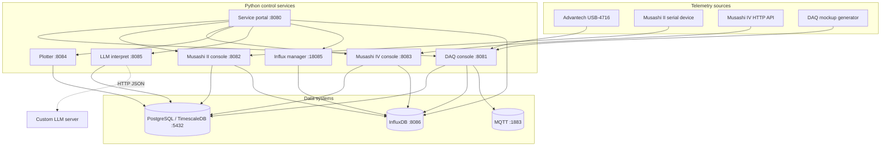

# MDDP Architecture Guide

This document describes the runtime boundaries and data paths of the MDDP Ingestion Control Suite. The root [README](../README.md) is the operator-facing setup guide; this page is for maintainers extending services or deployment scripts.

## Runtime topology



## Service responsibilities

### DAQ USB-4716

`services/daq_usb4716/app.py` owns the Flask-SocketIO control surface. It persists configuration, starts and stops an ingestion subprocess, maintains desired state, and tails the pipeline log. The worker scripts own device reads and destination writes:

- `stream_to_db.py` reads real hardware.
- `mockup_stream_to_db.py` produces synthetic data.
- `mqtt_to_db.py` consumes MQTT batches and writes PostgreSQL/TimescaleDB.

The DAQ UI communicates with the control service through REST endpoints and Socket.IO events. It does not write to the database directly.

### Musashi services

Musashi II reads serial data and Musashi IV reads an HTTP device API. Their control services follow the same pattern as DAQ: the browser configures the service, the service owns the worker process, and the worker writes telemetry to the configured destination.

### Plotter

`services/plotter/app.py` is a stateless query API and chart host. It reads the active DAQ configuration to resolve the PostgreSQL DSN and exposes channel/data endpoints. Plotly.js renders the returned series in the browser.

### InfluxDB manager

`services/influxdb/app.py` is a control plane, not the database itself. It:

1. Reads and writes `influxdb_config.json`.
2. Writes `.env.influxdb` for Docker Compose initialization.
3. Starts and stops `mddp-influxdb` using `docker compose`.
4. Probes the InfluxDB `/health` endpoint.
5. Discovers an operator token from the container when possible.
6. Applies retention rules through the InfluxDB v2 HTTP API.
7. Synchronizes the connection settings to the DAQ service.

### LLM interpretation worker

`services/llm-interpret/app.py` starts a scheduler and a small health/control API. For each completed configured interval it queries the source time-series table, computes per-channel descriptive statistics, threshold counts, z-score anomalies, and bucketed Pearson correlations, then sends that compact result to the configured custom LLM. The final plain-text summary and metrics JSON are upserted into `llm_interpret_summaries`. A deterministic summary is stored when the LLM is unavailable, so a failed model request does not discard a completed database window.

## Data contracts

### PostgreSQL/TimescaleDB

The DAQ table is initialized by `scripts/sql/db_setup.sql`:

```sql
CREATE TABLE daq_samples (
    time TIMESTAMPTZ NOT NULL,
    channel INT NOT NULL,
    value DOUBLE PRECISION NOT NULL
);
```

The `time` column is the hypertable time key. Plotter queries filter by `channel` and time range, then return ISO timestamps and numeric values.

### MQTT

DAQ publishes a JSON array of sample objects to the configured topic:

```json
[
  {
    "time": "2026-07-20T11:40:00.000000+00:00",
    "channel": 0,
    "value": 2.45
  }
]
```

`mqtt_to_db.py` consumes the same contract and writes rows to PostgreSQL/TimescaleDB.

### InfluxDB

InfluxDB connection values are shared between the manager and DAQ configuration. The manager uses `INFLUX_URL`, `INFLUX_ORG`, `INFLUX_BUCKET`, and `INFLUX_TOKEN` for health, retention, and synchronization operations. The DAQ worker uses the same values when `DESTINATION=influxdb`.

## Startup and recovery

The DAQ, Musashi II, and Musashi IV services persist process metadata and desired state in service-local files. On service startup, they can reattach to an existing worker or restore a previously requested ingestion state, depending on the service configuration.

The Linux deployment scripts manage top-level service PID files:

- `.daq.pid`
- `.musashi_ii.pid`
- `.musashi_iv.pid`
- `.plotter.pid`
- `.influxdb_mgr.pid`

These files are operational state and should not be committed.

## Extension checklist

When adding a new telemetry source:

1. Define its storage schema and time key.
2. Add a worker that produces the existing timestamp/channel/value shape where possible.
3. Add a control service only if operators need runtime configuration or process control.
4. Add a plotter endpoint for the new schema.
5. Add the service to both launcher scripts and deployment documentation.
6. Add a health/status endpoint and a focused test.
7. Reuse the shared UI patterns in `services/influxdb/static/ui-tokens.css` and `ui-patterns.css`.
