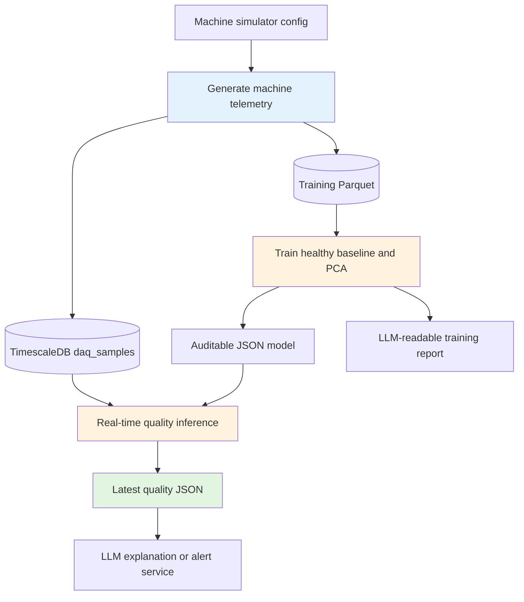

# Machine telemetry ML and real-time quality

This service generates correlated machine sensor data, learns normal multivariate behavior, discovers sensor relationships, and writes an LLM-readable real-time machine-quality result.

For a cell-by-cell review of the calculations, open `data_preprocess.ipynb` and run all cells. The notebook mirrors and checks parity with `machine_ml.py`; the Python module remains the production pipeline.

## Data flow



The ML decision is made before the LLM is called. The LLM receives the status, score, sensor values, largest deviations, and learned relationships to explain the result; it is not asked to invent the classification.

## Simulated channels

| Channel | Sensor | Unit | Expected relationship |
|---:|---|---|---|
| 0 | Motor speed | rpm | Falls slightly as fault severity rises |
| 1 | Machine load | % | Common operating-condition driver |
| 2 | Vibration RMS | mm/s | Rises strongly with mechanical faults |
| 3 | Bearing temperature | °C | Rises with load and fault severity |
| 4 | Motor current | A | Rises with load and fault severity |
| 5 | Shaft displacement | mm | Rises with mechanical faults |
| 6 | Acoustic level | dB | Rises with load, vibration, and faults |
| 90 | Simulator ground truth | class | `0=healthy`, `1=warning`, `2=critical`; never used as an input feature |

One simulator cycle is 300 seconds by default: 60% healthy, 25% warning, and 15% critical. The generated sensor noise is deterministic, which makes tests and model comparisons repeatable.

## Quick start

Run these commands from `services/llm-data-interpret`.

### 1. Install dependencies

```bash
python3 -m venv .venv
.venv/bin/pip install -r requirements.txt
```

Expected result: NumPy, pandas, PyArrow, psycopg2, plotting tools, and Flask are installed.

### 2. Generate historical simulation data

```bash
.venv/bin/python sim-data/generate_training_data.py
```

Expected result:

```text
generated 7,208 rows at .../machine_training_samples.parquet
```

The default 900-second dataset contains three complete health cycles, sampled once per second across eight channels.

### 3. Train and save the model

```bash
.venv/bin/python machine_ml.py train
```

This creates:

- `artifacts/machine_quality_model.json`: normalization, inverse covariance, PCA components, thresholds, and learned relationships.
- `artifacts/ml_training_report.json`: compact results and guidance intended for an LLM or operator.

The trainer uses only channel 90 to select healthy rows and calibrate simulation thresholds. Channel 90 is excluded from model features.

### 4. Verify offline inference

```bash
.venv/bin/python machine_ml.py infer --input machine_training_samples.parquet
```

Expected result: `artifacts/latest_machine_quality.json` containing the latest status, health percentage, anomaly score, sensor readings, top contributors, alerts, and learned relationships.

### 5. Start live simulation and inference

Start each process in a separate terminal:

```bash
.venv/bin/python sim-data/simulator.py
```

```bash
.venv/bin/python realtime_quality.py
```

The detector polls recent complete timestamp groups from TimescaleDB and atomically replaces `artifacts/latest_machine_quality.json` whenever a new sample arrives. Use `--once` to score only one window.

## LLM consumption contract

The LLM-facing service should read only complete JSON files:

1. Read `artifacts/ml_training_report.json` when the model changes.
2. Watch `artifacts/latest_machine_quality.json` for real-time updates.
3. Pass `machine_quality`, `top_contributors`, `sensor_readings`, `learned_relationships`, `alerts`, and `llm_context` to the LLM.
4. Treat the ML `status` as authoritative for the explanation. Do not let free-form LLM text override a safety controller.

Example real-time result:

```json
{
  "machine_quality": {
    "status": "warning",
    "health_percent": 63.2,
    "anomaly_score": 22.4
  },
  "top_contributors": [
    {"name": "Vibration RMS", "value": 4.8, "unit": "mm/s", "deviation_sigma": 8.1}
  ],
  "alerts": ["Machine state is warning; inspect Vibration RMS and related sensors."]
}
```

## Production use

Simulation-to-real transfer is useful for integration testing, but it is not sufficient for unattended production decisions. Before deployment:

- Map real DAQ channels to the same sensor names and physical units.
- Collect verified healthy data across normal speeds and loads, then retrain the baseline.
- Validate warning and critical thresholds against known maintenance events.
- Add stale-data, missing-sensor, and database-disconnection alarms.
- Keep a deterministic PLC/interlock or other fail-safe for machine shutdown. The LLM should explain and route alerts, not be the only safety mechanism.

## Tests

```bash
.venv/bin/python tests/test_machine_quality.py
```

The tests verify fault progression, correlated sensor behavior, model training, and healthy/warning/critical inference.
